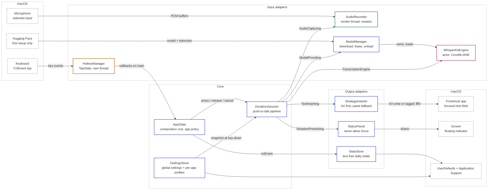
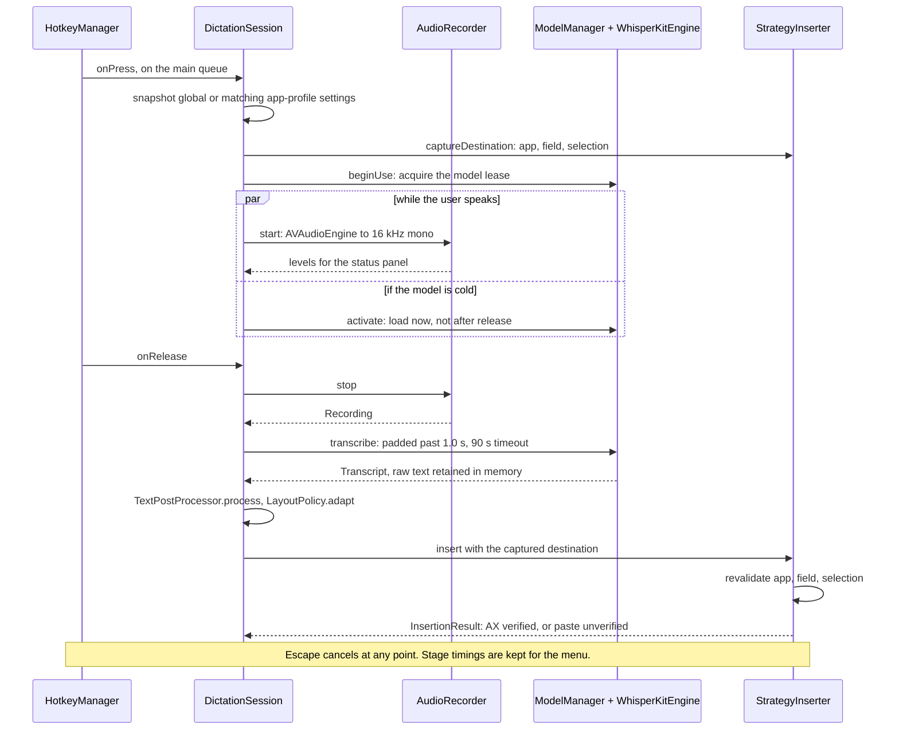

# Murmur architecture

A ten-minute map for contributors. The operational cheat sheet with macOS
gotchas is [CLAUDE.md](../CLAUDE.md); this page describes responsibilities,
interfaces, concurrency, and storage.

## Components and who calls whom

Arrows point from caller to callee, and the border colour is the execution
context:

- blue — `@MainActor`: all orchestration and every seam call
- amber — the CGEvent tap's own thread, which must return in microseconds
- teal — the audio render thread, which appends buffers under a lock
- pink — a Swift actor, which serializes model loads and inference
- dashed grey — macOS or the network, outside the app

The labels between the core and its neighbours are the protocol seams in
`Dictation/DictationSeams.swift` and `Insertion/TextInserter.swift`; the table
under [Seams](#seams) lists the fake each one is swapped for in tests.
`AppState` constructs every component, so ownership edges are left out.

## The dictation flow

Two orderings carry the design. The destination and configuration are captured
at key-down and checked again before delivery, so a settings change or a focus
change mid-dictation cannot alter or misdirect the result. A cold model starts
loading while the user is still speaking rather than after the key comes up.

Escape cancels recording or the active user flow. A cancelled or timed-out
CoreML call may finish internally, but its result is invalidated, the engine
lease stays held until it stops, and it cannot insert late or overlap another
dictation. Raw and processed recovery text remains only in memory until it is
cleared or the app quits.

Everything visible during the flow goes through `DictationPresenting` (the
floating status panel). One-off outcomes are `DictationEvent`s; continuous
state is published by `DictationSession`.

## Modules

| Module | Files | Responsibility and interface |
|---|---|---|
| Composition root | `App/AppState.swift`, `App/MurmurApp.swift` | Constructs subsystems and owns app policy: explicit startup, permissions → hotkey listener, shortcuts, microphone-test exclusion, model activation/idle unload, windows, status-panel refresh and aggregate statistics. Construction has no global event-tap side effect. |
| Dictation | `Dictation/DictationSession.swift`, `Dictation/DictationSeams.swift`, `Dictation/DictationTiming.swift` | `press`, `release`, `cancel`, sample/recovery insertion, phase machine, configuration/destination snapshots, model lease, timeout invalidation, in-memory recovery, delivery status and stage timing. Depends on the four seams plus configuration closures. |
| Hotkey | `Hotkey/Hotkey.swift`, `Hotkey/HotkeyManager.swift` | Push-to-talk, verbatim, paste-last, copy-last and Escape handling. `TapState` is the pure state machine. Tap-disable recovery clears held state. The CGEvent callback stays fast and off main; callbacks arrive on main. |
| Audio | `Audio/AudioRecorder.swift`, `Audio/AudioDevices.swift`, `Audio/AudioRestartPolicy.swift` | `AudioCapturing`, device enumeration/ranking, 16 kHz capture, level reporting, duration cap, Bluetooth/configuration restart and generation guards against stale buffers/watchdogs. Settings UI owns the separate in-memory level-test recorder. |
| Speech | `Transcription/*` | `TranscriptionEngine` actor, WhisperKit adapter, model catalog/manager, complete Whisper language catalog, short-audio padding, model lifecycle/lease and pure recognition scoring. `ModelAvailability` is the readiness answer. |
| Insertion | `Insertion/*` | Captures and compares the intended process, AX element and selection. `StrategyInserter` revalidates before writing and before fallback, adapts line breaks, and returns delivery evidence. Accessibility is verified when read-back succeeds; paste is unverified. `TemporaryClipboard` restores a deep snapshot unless a newer copy exists. |
| Text | `PostProcessing/*` | Pure cleanup, boundary-safe corrections, explicit snippets/punctuation/layout commands, verbatim bypass, vocabulary validation/import/export and destination newline policy. These rules preserve recognized words unless the user configured a deterministic replacement. |
| Settings | `Settings/SettingsStore.swift`, `Settings/AppProfile.swift` | Tolerantly decoded JSON settings and resolution of explicit per-app language, insertion, cleanup and newline preferences. Profiles are snapshotted at key-down. |
| UI | `UI/*` | Menu recovery/status, onboarding, six settings tabs, statistics window and status panel. `render(PanelState)` is the status panel's state boundary; the panel never takes focus. |
| Support | `Support/*`, `Permissions/`, `Stats/`, `Resources/Localizable.xcstrings` | Permission polling, diagnostics, sounds, links, launch-at-login UI, text-free daily aggregates and the English string-catalog foundation. |

## Seams

| Seam | Production adapter | Test adapter |
|---|---|---|
| `AudioCapturing` | `AudioRecorder` | `FakeRecorder` |
| `ModelProviding` | `ModelManager` | `FakeModels` + `ScriptedEngine` |
| `TranscriptionEngine` | `WhisperKitEngine` | `ScriptedEngine` and model-manager fakes |
| `TextInserting` | `StrategyInserter` | `FakeInserter` |
| `TextWriting` | `AccessibilityWriter`, `PasteboardWriter` | `FakeWriter` |
| `DestinationChecking` | `FrontmostDestination` | `FakeDestinationChecker` |
| `DictationPresenting` | `StatusPanel` | `FakePresenter` |

Pipeline behavior belongs in `DictationSession` with a regression test.
Hardware, Accessibility and window-system details stay in thin adapters;
complex decisions move into pure policies before they grow branches.

## Concurrency

- User-facing orchestration and all seam calls are `@MainActor`.
- The CGEvent tap owns a thread and only mutates `TapState` under a lock before
  scheduling callbacks on main. Synthetic events carry `SyntheticEvents.tag`.
- `WhisperKitEngine` is an actor. `ModelManager` serializes loads and leases
  one model to a dictation until the physical inference call finishes.
- Audio buffers arrive on the render thread. `AudioRecorder` converts and
  appends under a lock, identifies captures/engines by generation, and hops to
  main for UI callbacks.
- Synchronous Accessibility work runs away from the main thread; destination
  capture and decisions return through main-actor interfaces.

## Persistence and privacy boundaries

- `UserDefaults` stores JSON under `murmur.*`: shortcuts, model/language,
  microphone choices, profiles, text rules, explicit vocabulary/snippets,
  panel position and other preferences. Stored structs decode missing fields
  with safe defaults.
- Model and tokenizer data lives under
  `~/Library/Application Support/Murmur/Models`.
- Daily aggregate, text-free statistics live in
  `~/Library/Application Support/Murmur/Statistics.json`; a corrupt aggregate
  may be quarantined beside it.
- Audio, captured destinations, and recent raw/processed transcripts stay in
  memory. They are not added to settings, statistics, diagnostics, or logs.
- A diagnostics report is written only after the user chooses a destination.
  Vocabulary export is likewise an explicit user action.

Murmur remains push-to-talk, menu-bar-only, local after model/tokenizer setup,
without accounts, telemetry, automatic update checks, a transcript editor,
streaming results, or persistent transcript/audio history.
